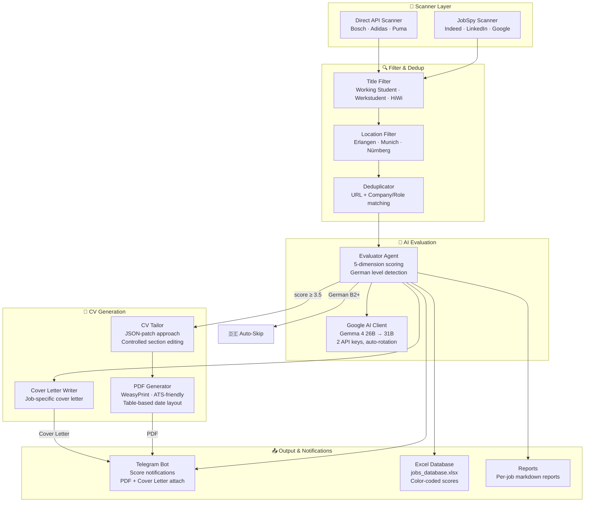

# JobHunter — Autonomous Job Search Pipeline

Fully automated job search, evaluation, CV tailoring, and notification system for working student positions in Germany. Scans multiple job boards, evaluates matches with AI, generates tailored CVs as PDFs, and sends results to your Telegram.

## How It Works

```
┌─────────┐     ┌──────────┐     ┌───────────┐     ┌────────────┐     ┌──────────┐
│  Scan   │────▶│  Filter  │────▶│ Evaluate  │────▶│ Tailor CV  │────▶│ Telegram │
│ JobSpy  │     │ + Dedup  │     │ Google AI │     │ + PDF Gen  │     │   Bot    │
└─────────┘     └──────────┘     └───────────┘     └────────────┘     └──────────┘
  Indeed          Title +          Gemma 4           JSON-patch         Score + PDF
  LinkedIn        Location         2-key rotation    controlled         + Cover Letter
  Google Jobs     History          OpenRouter         WeasyPrint        + Excel DB
                                   4-key rotation
```

### Pipeline Steps

1. **Scan** (`run_scan.py`) — Uses [python-jobspy](https://github.com/Bunsly/JobSpy) to search Indeed, LinkedIn, and Google Jobs for configured search terms and locations. Results are saved to `data/pipeline.md`.

2. **Filter & Dedup** — Title keywords (e.g. "Working Student", "Werkstudent") and location (e.g. Erlangen, Nürnberg, Munich) are checked. Jobs already seen are skipped. Descriptions are cached in `data/jd_cache.json` for evaluation.

3. **Evaluate** (`run_evaluate.py`) — Each job is scored 1-5 across 5 dimensions using Google AI Studio (Gemma 4, 1,500+ free requests/day with dual keys). Scores below threshold are logged. **Jobs requiring German B2+ are auto-rejected.**

4. **Tailor CV** — For jobs scoring ≥ threshold (default 3.5), the AI proposes targeted JSON edits (subtitle, objective keywords, skills reorder, bullet rephrasings, project selection). Code applies these edits programmatically — **the AI never touches dates, headers, or formatting.**

5. **Generate PDF** — Tailored CV is converted to an ATS-friendly A4 PDF using WeasyPrint. Dates are right-aligned using table layout. Role-specific subtitle is injected.

6. **Telegram** — Every evaluation is sent as a notification. High-scoring jobs include the PDF CV and cover letter as attachments.

7. **Excel Database** — Every evaluated job is recorded in `data/jobs_database.xlsx` with scores, reasoning, and status. Updated inline after each evaluation.

## Quick Start

### 1. Clone & Install

```bash
git clone https://github.com/MohamedAzzam4/JobHunter.git
cd JobHunter
python -m venv jobhunter_venv
jobhunter_venv\Scripts\activate   # Windows
pip install -r requirements.txt
```

**WeasyPrint (PDF generation) on Windows:**
```bash
# Install MSYS2 from https://www.msys2.org/
# Then in MSYS2 terminal:
pacman -S mingw-w64-x86_64-pango
```
The code auto-detects the GTK libraries at `C:\msys64\mingw64\bin`.

### 2. Configure

Copy and fill in your credentials:
```bash
cp .env.example .env
```

**`.env` contents:**
```
# OpenRouter API keys (create free accounts at openrouter.ai)
OpenRouter=sk-or-v1-...
OpenRouter2=sk-or-v1-...
OpenRouter3=sk-or-v1-...
OpenRouter4=sk-or-v1-...

# Google AI Studio (free at aistudio.google.com)
# Key 2 has 1,500 RPD — used as primary after Key 1's 86 RPD is exhausted
GOOGLE_AI_API_KEY=AIza...
GOOGLE_AI_API_KEY2=AIza...

# Telegram Bot (create via @BotFather on Telegram)
TELEGRAM_BOT_TOKEN=123456:ABC...
TELEGRAM_CHAT_ID=your-chat-id
```

**`config/profile.yml`** — Your candidate info:
```yaml
candidate:
  full_name: "Your Full Name"
  short_name: "First Last"         # Used for PDF filenames
  email: "your@email.com"
  phone: "+49 ..."
  location: "Your City, Germany"
  subtitle: "AI Engineer | Working-Student Candidate"
  linkedin: "https://linkedin.com/in/your-profile"
  github: "https://github.com/your-username"

evaluation:
  auto_cv_threshold: 3.5           # Minimum score to generate CV
```

**`cv.md`** — Your base CV in markdown format.

**`config/portals.yml`** — Search queries, locations, and job sites to scan.

### 3. Run

```bash
# Scan for new jobs
python run_scan.py

# Evaluate next job
python run_evaluate.py --next

# Evaluate a batch of 10
python run_evaluate.py --batch 10

# Evaluate all pending jobs
python run_evaluate.py --all

# Full automated cycle (scan + evaluate all)
python run_all.py
```

## Architecture



### Directory Structure

```
job_apply/
├── agents/                    # AI Agent Layer
│   ├── evaluator.py           #   Job scoring (5 dimensions + German detection)
│   ├── cv_tailor.py           #   JSON-patch CV adaptation
│   ├── cover_letter.py        #   Cover letter generation
│   ├── google_client.py       #   Google AI Studio (2-key rotation)
│   ├── smart_router.py        #   Multi-provider AI routing
│   └── openrouter_client.py   #   OpenRouter (4-key rotation)
├── scanners/                  # Data Collection Layer
│   ├── jobspy_scanner.py      #   Indeed/LinkedIn/Google Jobs via python-jobspy
│   ├── bridge.py              #   Filter → Dedup → Pipeline writer + JD cache
│   ├── workday.py             #   Direct Workday/SmartRecruiters API
│   └── base.py                #   Base scanner interface
├── utils/                     # Utility Layer
│   ├── telegram.py            #   Push notifications + file attachments
│   ├── pdf_generator.py       #   WeasyPrint PDF with table date layout
│   ├── excel_export.py        #   XLSX export with color-coded scores
│   ├── jd_cache.py            #   Cache JDs from scan time (solves Indeed 403)
│   ├── jd_fetcher.py          #   Fetch job descriptions via HTTP/Playwright
│   ├── filters.py             #   Title and location filtering
│   └── dedup.py               #   URL + company/role deduplication
├── config/
│   ├── profile.yml            #   Candidate info, skills, thresholds
│   └── portals.yml            #   Search queries and job sites
├── data/
│   ├── pipeline.md            #   Job queue ([ ] pending, [x] checked)
│   ├── jd_cache.json          #   Cached job descriptions
│   ├── jobs_database.xlsx     #   All evaluated jobs (Excel)
│   ├── below_threshold.md     #   Low-scoring jobs for review
│   ├── applications.md        #   Evaluation tracker
│   └── scan-history.tsv       #   All seen jobs with status
├── output/                    #   Generated CVs (.md + .pdf) and cover letters
├── reports/                   #   Evaluation reports per job
├── tests/                     #   36 tests (dedup, filters, bridge)
├── cv.md                      #   Your base CV
├── run_scan.py                #   Scanner entry point
├── run_evaluate.py            #   Evaluator entry point
├── run_all.py                 #   Full pipeline (scan + evaluate)
└── requirements.txt
```

## AI Routing Strategy

The system uses a tiered approach to maximize free API quotas:

| Task | Primary Provider | Fallback | Daily Quota |
|------|-----------------|----------|-------------|
| **Evaluation** | Google AI Studio (Gemma 4 26B) | Gemma 4 31B → rotate key → OpenRouter | ~1,586/day (86 + 1,500) |
| **CV Tailoring** | OpenRouter (4-key rotation) | Key1 → Key2 → Key3 → Key4 | ~800/day |
| **Cover Letter** | OpenRouter (4-key rotation) | Same rotation | ~800/day |

**Total: ~3,186 API calls/day for free.**

### Google API Key Rotation

```
Request → Key[0] (86 RPD) → 429? → Key[1] (1,500 RPD) → 429? → All keys exhausted
                            ↓                              ↓
                        500 error?                    500 error?
                        Try next model                Try next model
                        (same key)                    (same key)
```

## CV Tailoring Strategy

The AI uses a **JSON-patch approach** — it proposes specific edits and the code applies them:

```json
{
  "subtitle": "AI & Data Engineer | Working-Student Candidate",
  "objective": "Adapted objective with JD keywords...",
  "skills_order": ["Data Science & Analysis", "Programming Languages", ...],
  "experience_bullets": {
    "Freelance AI & Web Developer": ["rephrased bullet with JD keywords..."]
  },
  "projects_to_keep": ["Project Sanad", "AI Customer Service Agent"],
  "projects_to_remove": ["Automatic Image Colorization using U-Net"]
}
```

**What the AI CAN do:**
- ✅ Suggest a role-specific subtitle and objective
- ✅ Reorder skills categories by relevance
- ✅ Rephrase experience bullets with JD keywords
- ✅ Select which projects to highlight/remove

**What the AI CANNOT do (enforced by code):**
- ❌ Change dates, company names, or numbers
- ❌ Add new bullets beyond the original count
- ❌ Modify Education, Certifications, or Languages
- ❌ Exceed the original objective length
- ❌ Break the markdown/HTML formatting

## German Language Detection

Jobs are classified into 4 levels:

| Level | German Required? | Action |
|-------|-----------------|--------|
| **none** | No | Normal evaluation |
| **A1-A2** | No | Normal evaluation (candidate has A2) |
| **B1** | Yes | 🇩🇪 **Auto-rejected** — score forced to 0 |
| **B2+** | Yes | 🇩🇪 **Auto-rejected** — score forced to 0 |

**Generic phrases like "gute Deutschkenntnisse" (good German skills) are classified as B2+** because they imply fluency beyond A2.

## Telegram Notifications

1. Message [@BotFather](https://t.me/BotFather) on Telegram → `/newbot` → get your token
2. Message [@userinfobot](https://t.me/userinfobot) → get your chat ID
3. Add both to `.env`

You'll receive:
- 📊 Score notification for every evaluated job (with German level)
- 📄 PDF CV attachment for high-scoring matches
- 📋 Cover letter attachment
- 🇩🇪 German auto-skip notifications

## Excel Database

All evaluated jobs are tracked in `data/jobs_database.xlsx`:
- Auto-updated after each evaluation
- Color-coded scores (green ≥4.0, yellow ≥3.5, orange ≥3.0, red <3.0)
- Deduplicated by URL
- Includes all 5 scoring dimensions + reasoning

## Docker (Automated Scheduling)

```bash
docker-compose up -d
```

Runs `run_all.py` every 6 hours automatically.

## License

MIT
